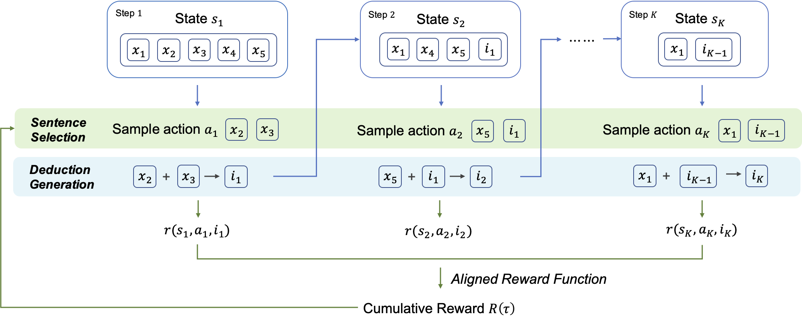

# RLET

Implementation for EMNLP 2022 [paper](https://aclanthology.org/2022.emnlp-main.483.pdf):

RLET: A Reinforcement Learning Based Approach for Explainable QA with Entailment Trees



## Install dependencies

Install all the dependencies in the requirements.txt file:
```
pip -r requirements.txt
```
Install [BLEURT](https://github.com/google-research/bleurt)
```
BLEURT
pip install --upgrade pip  # ensures that pip is current
git clone https://github.com/google-research/bleurt.git
cd bleurt
pip install .
```
Install spacy
```
python3 -m spacy download en_core_web_sm
```

## Run the code


### Data preparation

Download the dataset from [EntailmentBank](https://allenai.org/data/entailmentbank) and put it in the data folder. The folder should look like this:
```
├── data
│   ├── entailment_trees_emnlp2021_data_v3
│   │   ├── dataset
│   │   │   ├── ...
│   │   └── supporting_data
│   │       └── ...
│   ├── prepare_warmup_data.py
└── └── prepare_warmup_data_task23.py
```

Run the following command to preprocess the data for warmup training stage:
```
bash scripts/prepare_data.sh
```
That should generate the data at `data/warmup/task1` and `data/warmup/task23`.


### Warmup training

Before training, please initiate fitlog by running the following command:
```
fitlog init
```
Run the following command to start training:
```
# Task 1
bash scripts/run_warmup.sh
# Task 2/3
bash scripts/run_warmup_task23.sh
```


### RL training
 
Run the following command to start training. Remember to change the `--policy_model_path` to the path of the checkpoint from the warmup training stage.
```
# Task 1
bash scripts/run_rl_task1.sh
# Task 2/3
bash scripts/run_rl_task23.sh
```


### Evaluation

To evaluate the model, change the `--policy_model_path` to the path of the checkpoint from the RL training stage.
You can also download the checkpoint from [here]() and put it in the `outputs/examples` folder. Then run the following command:
```
# Task 1
bash scripts/test_rl_task1.sh
# Task 2
bash scripts/test_rl_task2.sh
# Task 3
bash scripts/test_rl_task3.sh
```

You should be able to get the following output:
```
[Metric] Saved EB format predictions as PATH_TO_PREDICTION/pred_para.tsv        
```

Use the generated file and follow the instructions in this [repo](https://github.com/allenai/entailment_bank) to evaluate the results.


## Questions

If you have any questions, please feel free to open an issue or contact me at `txliu21@m.fudan.edu.cn`.

## Credits

Our code is based on [ParaPattern](https://github.com/alephic/ParaPattern), [rlhr](https://github.com/amzn/zero-shot-rlhr). Great thanks to the authors for their work!
